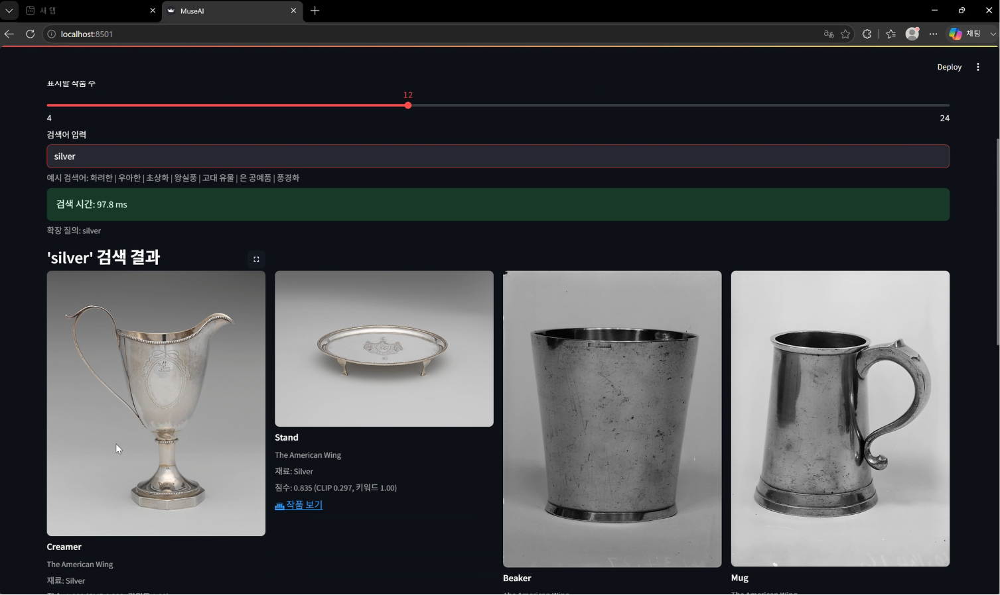

# 🏛 MuseAI: CLIP 기반 의미 중심 미술품 검색 시스템

## 1. 프로젝트 개요

MuseAI는 사용자가 입력한 자연어의 의미를 이해하여 Met Museum 소장 작품을 검색하는 Semantic Artwork Search 시스템입니다.

기존 검색 시스템은 작품명이나 키워드가 정확히 일치해야 원하는 결과를 찾을 수 있습니다. 하지만 실제 사용자는 다음과 같이 추상적인 표현을 사용하는 경우가 많습니다.

- 화려한 장식품
- 우아한 유리 공예품
- 왕실풍 작품
- 고풍스러운 유물
- 초상화

본 프로젝트는 OpenCLIP과 FAISS를 활용하여 이러한 자연어 표현을 벡터 공간으로 변환하고, 의미적으로 유사한 작품을 검색할 수 있도록 설계되었습니다.

또한 BLIP(Image Captioning)를 활용하여 작품 이미지를 자동 설명 문장으로 변환함으로써 검색 성능을 향상시켰습니다.

---

## 2. 프로젝트 목표

본 프로젝트의 목표는 다음과 같습니다.

1. Met Museum Open Access 데이터 활용
2. 의미 기반 미술품 검색 구현
3. OpenCLIP 기반 텍스트-이미지 매칭
4. FAISS 기반 고속 검색
5. 웹 서비스 형태의 검색 인터페이스 제공

---

## 3. 시스템 전체 구조

### 데이터 구축 파이프라인

```
Met Museum Open Access Dataset
↓
Public Domain 작품 필터링
↓
작품 메타데이터 수집
↓
이미지 다운로드
↓
BLIP Caption 생성
↓
OpenCLIP 임베딩 생성
↓
FAISS Index 생성
↓
웹 서비스 제공
```

---

### 검색 파이프라인

```
사용자 검색어 입력
↓
Query Expansion
↓
OpenCLIP Text Encoder
↓
텍스트 임베딩 생성
↓
FAISS Similarity Search
↓
유사 작품 Top-K 반환
↓
Streamlit UI 출력
```

---

## 4. 사용 기술

### AI 모델

#### OpenCLIP

| 항목 | 내용 |
|------|------|
| 모델 | ViT-L-14 |
| 사전학습 | LAION2B (laion2b_s32b_b82k) |
| 역할 | 자연어 임베딩 생성, 작품 의미 벡터 생성 |

#### BLIP

| 항목 | 내용 |
|------|------|
| 모델 | Salesforce/blip-image-captioning-base |
| 역할 | 이미지 자동 설명 생성, 검색 성능 향상 |

### 검색 엔진

#### FAISS (Facebook AI Similarity Search)

- 벡터 검색
- Top-K 유사도 검색

### 웹 프레임워크

#### Streamlit

- 검색 UI 제공
- 성능 지표 시각화
- 검색 결과 출력

---

## 5. 폴더 구조

```
MuseAI
│
├── app.py
├── config.py
├── prepare_data.py
├── download_images.py
├── generate_captions.py
├── build_index.py
├── evaluate.py
├── requirements.txt
│
├── data/                       # .gitignore 제외 (직접 구축 필요)
│   ├── metadata.csv
│   ├── valid_metadata.csv
│   ├── valid_metadata_blip.csv
│   └── images/
│
├── artifacts/                  # .gitignore 제외 (직접 구축 필요)
│   ├── met.index
│   └── metrics.json
│
├── docs/
│   └── app_screenshot.png
│
└── README.md
```

---

## 6. 파일별 역할

### config.py

프로젝트 전역 설정 파일

- 데이터 경로
- 모델 종류
- FAISS 인덱스 경로
- 성능 결과 저장 경로

```python
MODEL_NAME = "ViT-L-14"
PRETRAINED = "laion2b_s32b_b82k"
```

---

### prepare_data.py

Met Museum 데이터셋을 다운로드하고 학습에 사용할 작품을 선별한다.

- Public Domain 작품 필터링
- 주요 Department 선택
- 작품 메타데이터 저장

출력: `data/metadata.csv`

---

### download_images.py

메타데이터에 포함된 작품 이미지를 다운로드한다.

- Met API 호출
- 이미지 다운로드
- 이미지 경로 저장

출력: `data/images/`, `data/valid_metadata.csv`

---

### generate_captions.py

BLIP 모델을 이용하여 작품 설명 문장을 생성한다.

예시:
```
이미지 → "a group of five pieces of glass"
       → "Glass-Vessels. European Sculpture and Decorative Arts."
```

출력: `data/valid_metadata_blip.csv`

---

### build_index.py

검색을 위한 벡터 인덱스를 생성한다.

```
BLIP Caption → OpenCLIP Text Encoder → Vector Embedding → FAISS Index
```

출력: `artifacts/met.index`

---

### evaluate.py

Baseline 및 BLIP 적용 모델 성능을 평가한다.

평가 지표:
- Zero-shot Accuracy
- Image Retrieval R@1
- Image Retrieval R@5
- Inference Latency

출력: `artifacts/metrics.json`

---

### app.py

최종 검색 웹 서비스

- 검색어 입력
- Query Expansion
- 의미 기반 검색
- 성능 지표 표시
- Met Museum 링크 제공

---

## 7. 설치 방법

### 개발 환경

- Python 3.10 이상
- pip 23 이상
- (선택) CUDA 지원 GPU — CPU에서도 동작하나 캡션 생성 속도 저하

### 저장소 복제

```bash
git clone https://github.com/yeoonwooo/MuseAI.git
cd MuseAI
```

### 가상환경 생성 및 활성화

```bash
# Windows
python -m venv .venv
.venv\Scripts\activate

# macOS / Linux
python -m venv .venv
source .venv/bin/activate
```

### 의존성 설치

```bash
pip install -r requirements.txt
```

---

## 8. 데이터 구축 방법

### 1단계 — 메타데이터 생성

```bash
python prepare_data.py
```

생성: `data/metadata.csv`

### 2단계 — 이미지 다운로드

```bash
python download_images.py
```

생성: `data/images/`, `data/valid_metadata.csv`

### 3단계 — BLIP 캡션 생성

```bash
python generate_captions.py
```

생성: `data/valid_metadata_blip.csv`

> ⏱ GPU 없는 환경에서는 656개 이미지 기준 수 시간 소요될 수 있습니다.

### 4단계 — FAISS 인덱스 생성

```bash
python build_index.py
```

생성: `artifacts/met.index`

### 5단계 — 성능 평가

```bash
python evaluate.py
```

생성: `artifacts/metrics.json`

---

## 9. 웹 서비스 실행

가상환경을 활성화한 뒤 아래 명령어로 실행한다.

```bash
python -m streamlit run app.py
```

실행 후 `http://localhost:8501` 접속

---

## 9-1. 실행 화면



웹 앱 상단에는 현재 검색 방식과 평가 지표가 표시된다.

- **검색 방식**: OpenCLIP 이미지/캡션/메타데이터 하이브리드 임베딩 + FAISS 후보 검색 + Re-ranking
- **성능 지표**: Zero-shot Accuracy, Image Retrieval R@1, Image Retrieval R@5, Inference Latency
- **검색 결과**: 작품 이미지, 제목, 부서, 분류, 매체, BLIP 캡션, 최종 점수 출력

---

## 10. 성능 결과

### Baseline — OpenCLIP + FAISS

| Metric | Score |
|--------|-------|
| Zero-shot Accuracy | 43.10% |
| Image Retrieval R@1 | 19.49% |
| Image Retrieval R@5 | 35.41% |
| Inference Latency | 1020.50 ms |

### Improved — BLIP Caption + OpenCLIP Hybrid Embedding + FAISS + Re-ranking

| Metric | Score |
|--------|-------|
| Zero-shot Accuracy | 43.10% |
| Image Retrieval R@1 | 28.98% |
| Image Retrieval R@5 | 47.42% |
| Inference Latency | 593.01 ms |

**성능 향상**

- R@1 +9.49%p (+48.7%)
- R@5 +12.01%p (+33.9%)
- Latency 약 41.8% 감소 (1020ms → 593ms)
- Zero-shot Accuracy는 동일하게 측정되었으며, 클래스 라벨 자체를 맞히는 성능보다 이미지 검색 상위 노출 품질이 개선되었다.

---

## 11. 대용량 파일 및 재현 가능성

### 대용량 파일 처리

GitHub는 100MB를 초과하는 파일 업로드를 제한하므로, 모델 가중치와 생성 산출물은 레포지토리에 포함하지 않는다.

`.gitignore`에서 다음 항목을 제외한다.

```
data/
artifacts/
*.pt
*.onnx
*.npy
*.index
```

OpenCLIP과 BLIP 가중치는 실행 시 `open-clip-torch`, `transformers` 라이브러리를 통해 자동으로 다운로드된다. 따라서 새 PC에서는 `requirements.txt` 설치 후 파이프라인을 다시 실행하면 동일한 구조의 산출물을 생성할 수 있다.

### 재현 절차

```bash
git clone https://github.com/yeoonwooo/MuseAI.git
cd MuseAI

# Windows
python -m venv .venv
.venv\Scripts\activate

# macOS / Linux
# source .venv/bin/activate

pip install -r requirements.txt
python prepare_data.py
python download_images.py
python generate_captions.py
python build_index.py
python evaluate.py
python -m streamlit run app.py
```

코드에는 개인 PC 절대 경로를 사용하지 않고, `config.py`의 프로젝트 기준 상대 경로를 사용한다.

---

## 12. 한계점

- 박물관 특화 데이터셋 부족
- BLIP가 일부 작품을 부정확하게 설명 (배경/프레임을 주요 피사체로 인식)
- Fine-tuning 데이터 수 부족
- 복잡한 예술적 개념 및 추상적 감성 어휘 이해 한계
- 전체 MetObjects.csv에는 작품이 많지만, 공개 도메인 여부, 이미지 URL 존재 여부, 실제 이미지 다운로드 성공 여부를 통과한 작품만 검색 인덱스에 포함되므로 평가 샘플 수가 제한됨
- 저작권 또는 이미지 미제공 작품을 제외하면 특정 부서와 클래스에 데이터가 치우칠 수 있어 Zero-shot Accuracy가 낮게 측정될 수 있음

---

## 13. 향후 개선 방향

- CLIP Fine-Tuning 적용
- BLIP Large 모델 적용
- 이미지 임베딩 기반 검색 전환
- 다국어 검색 지원 (KoCLIP 등)
- 사용자 피드백 기반 검색 개선

---

## 14. 팀원별 역할 분담

| 이름 | 역할 |
|------|------|
| 서정윤 | 데이터 수집 및 전처리, Met Museum 데이터셋 필터링, 결과 분석 |
| 김연우 | CLIP/BLIP 기반 검색 파이프라인 구현, Streamlit UI, 평가 및 문서화 |

---

## 15. 개발자

서정윤, 김연우

덕성여자대학교 IT미디어공학전공
